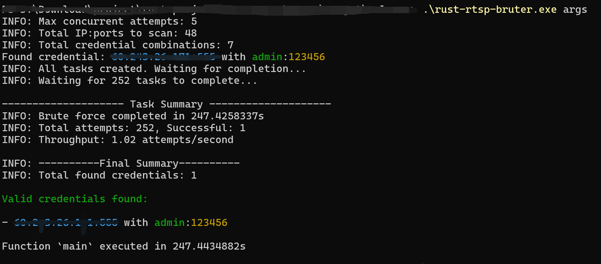
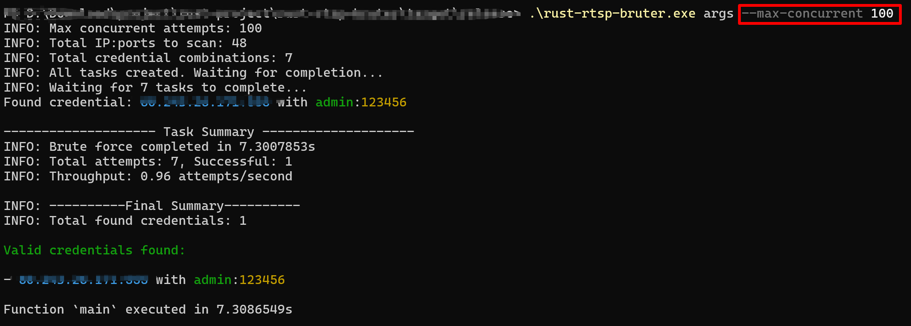
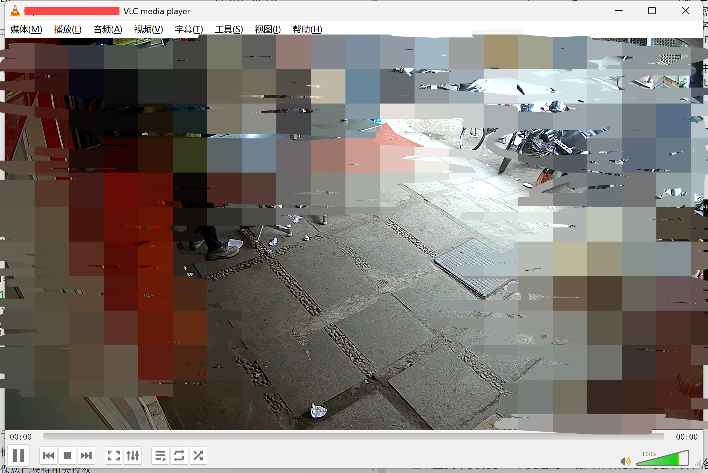
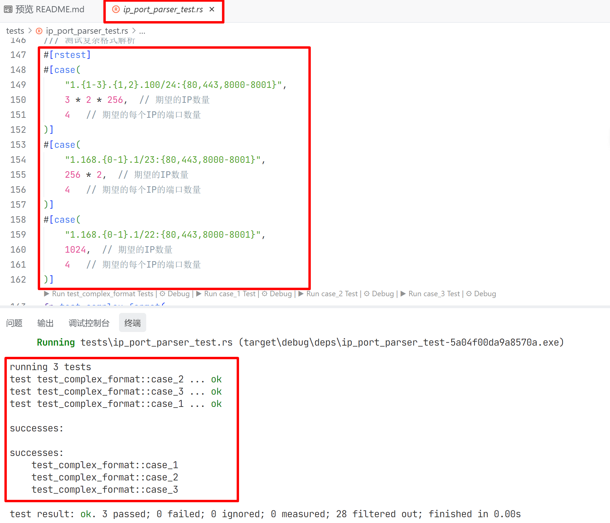

# RTSP Bruter 说明

## 工具概述
本项目是一款针对网络摄像头RTSP视频流**认证凭证**的**暴力枚举**工具，其核心设计思路是借助 RTSP 协议中用户名和密码的认证机制，使用至多2个rtsp请求（例如，本工具采用的 RTSP协议中的DESCRIBE 请求头，结合Basic和Digest认证方式），实现认证凭证的暴力枚举。

该工具主要用于合法的安全测试与评估场景。

## 核心功能
### DESCRIBE 请求的作用
在RTSP协议中，DESCRIBE请求用于向服务器请求指定媒体流的描述信息，通常以SDP(Session Description Protocol)格式返回。这些信息包括：
- 媒体流的数量和类型(音频/视频)
- 编码格式
- 传输协议
- 网络地址和端口信息

### RTSP DESCRIBE 请求核心功能流程
在请求上述信息的过程中，工具会自动处理认证挑战，支持Basic和Digest认证方式。
- Basic认证：简单的用户名和密码base64编码后在请求头中发送
- Digest认证：更安全的认证方式，包含质询响应，防止密码泄露

## 暴力枚举功能
本工具的一个核心特性是使用describe头，对RTSP服务器进行认证暴力枚举，主要用于安全测试和评估。

### 暴力枚举的实现理念
1. **字典攻击**：尝试使用常见的用户名和密码组合进行认证
2. **并发处理**：利用Rust的异步特性，并行尝试多个认证请求
3. **结果记录**：记录成功的认证凭据，便于后续分析

## 使用方法
### 编译
`cargo build --release`

编译产物：`target/release/rust-rtsp-bruter.exe`。编译成功后，相关示例配置文件同时被复制到`target/release`目录下。

rust-rtsp-bruter.exe大小：2.88 MB

### 使用帮助
```bash
# 基本使用
Usage: rust-rtsp-bruter.exe <COMMAND>

Commands:
  args  使用暴力枚举模式
  help  Print this message or the help of the given subcommand(s)

Options:
  -h, --help     Print help
  -V, --version  Print version
```

### 启动参数
#### 配置文件启动
为简化配置，使用了一个默认的配置文件，如下所示。
```toml
# 默认配置文件
mode = "brute"
users_file = "users.txt"
passwords_file = "passwords.txt"
ips_file = "iplist.txt"
max_concurrent = 5
```
用户可以使用`rust-rtsp-bruter.exe args`加载默认配置，运行工具。

运行上述命令会使用当前目录下的config.toml中的配置。如下图所示


用户可以修改上述配置，实现自定义配置。

#### 命令行参数
用户还可以基于上述配置文件，使用命令行参数进行特定配置，参数如下所示。
```text
# 基本使用
Usage: rust-rtsp-bruter.exe args [OPTIONS]

Options:
      --users-file <USERS_FILE>              包含用户名的文件路径 (与users_string二选一)
      --users-string <USERS_STRING>          用户名字符串 (与users_file二选一)
      --passwords-file <PASSWORDS_FILE>      包含密码的文件路径 (与passwords_string二选一)
      --passwords-string <PASSWORDS_STRING>  密码字符串 (与passwords_file二选一)
      --ips-file <IPS_FILE>                  包含IP地址的文件路径 (与ips_string二选一)
      --ips-string <IPS_STRING>              IP地址字符串 (与ips_file二选一)
  -m, --max-concurrent <MAX_CONCURRENT>      最大并发连接数 [default: 5]
  -h, --help                                 Print help
```

例如，在配置文件的基础上，覆盖最大并发连接数MAX_CONCURRENT，可以使用`rust-rtsp-bruter.exe args --max-concurrent 100`。

上述命令会首先加载配置文件，然后用命令行参数中的配置覆盖默认配置。

如下图所示。


基于rust的`async/await`异步框架，实现了并发的暴力枚举。将并发数量由`5 -> 100`, 时间由`247s` -> `7s`. 速度提升了30倍。

### 验证
使用用户名和密码，即可获取RTSP视频流。



### IP地址解析方法

普通的IP端口格式，例如`192.168.1.1-192.168.1.100`, `192.168.1.1:554`, 难以灵活的配置IP和端口。因此，本工具实现了一个灵活的IP端口解析方法，支持以下格式：

- 单IP地址：`192.168.1.1`
- IP地址范围：
  - `192.168.1.{1-100}` --> `192.168.1.1, 192.168.1.2, ..., 192.168.1.100`
- 端口范围：
  - `192.168.1.1:{554-555}` --> `192.168.1.1:554, 192.168.1.1:555`
- IP地址和端口范围：
  - `192.168.1.1:{554-555}` --> `192.168.1.1:554, 192.168.1.1:555`
  - `192.168.1.{1-100}:{554-555}` -->`192.168.1.1:554, 192.168.1.1:555, ..., 192.168.1.100:554, 192.168.1.100:555`

更多详细的IP地址解析例子，可参考测试文件[ip_port_parser_test.rs](tests\ip_port_parser_test.rs)。

 部分内容如下图：


## 安全提示
- 此工具仅用于合法的安全测试和授权评估
- 未经许可对他人的RTSP服务器进行暴力攻击可能违反法律法规
- 使用前请确保您已获得相关授权

## 技术栈
- Rust语言
- Tokio异步运行时